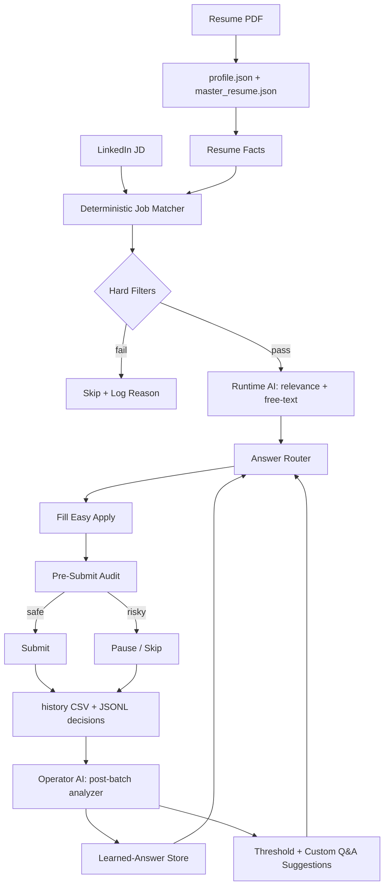

# Smart ApplyBot Reliability And Learning Plan

## Current Findings
- The bot entry point is [`/Users/deepanshrawal/Downloads/auto_jobs_applier_linkedin-main-2/runAiBot.py`](/Users/deepanshrawal/Downloads/auto_jobs_applier_linkedin-main-2/runAiBot.py), which delegates to [`/Users/deepanshrawal/Downloads/auto_jobs_applier_linkedin-main-2/applybot/__main__.py`](/Users/deepanshrawal/Downloads/auto_jobs_applier_linkedin-main-2/applybot/__main__.py).
- The project already supports AI through Gemini and OpenAI-compatible endpoints. A local LLM should be integrated through the existing OpenAI-compatible path in [`/Users/deepanshrawal/Downloads/auto_jobs_applier_linkedin-main-2/applybot/ai/openaiConnections.py`](/Users/deepanshrawal/Downloads/auto_jobs_applier_linkedin-main-2/applybot/ai/openaiConnections.py) by pointing `OPENAI_API_URL` to a local server such as Ollama, LM Studio, or llama.cpp server.
- The current “learning” behavior is not true adaptive learning. It appends observed answers to [`/Users/deepanshrawal/Downloads/auto_jobs_applier_linkedin-main-2/config/custom_questions.py`](/Users/deepanshrawal/Downloads/auto_jobs_applier_linkedin-main-2/config/custom_questions.py) when enabled, and uses pre-submit audit in [`/Users/deepanshrawal/Downloads/auto_jobs_applier_linkedin-main-2/applybot/pre_submit_verify.py`](/Users/deepanshrawal/Downloads/auto_jobs_applier_linkedin-main-2/applybot/pre_submit_verify.py).
- This folder currently has only example config files, no `config/secrets.py`, no `config/personals.py`, no `config/questions.py`, no `config/answers.py`, no `config/custom_questions.py`, no `config/profile.json`, and no root `resume.pdf`. Those are required for a smooth first run.

## Two-AI Architecture

The bot becomes meaningfully smarter when we split AI roles. Today everything is one in-process AI; this is fragile because Gemini quota or local LLM downtime degrades every decision.

- **Runtime AI (in-application):** runs inside [`applybot/__main__.py`](/Users/deepanshrawal/Downloads/auto_jobs_applier_linkedin-main-2/applybot/__main__.py) during each application. Used for relevance scoring, free-text answers, and select disambiguation. Provider order should be cost-aware: deterministic resume facts → local LLM → cloud LLM (Gemini/OpenAI). Critical for keeping the bot running when Gemini hits quota.
- **Operator AI (post-batch analyzer):** runs after every N applications (configurable, default 10) and at the end of each session. Reads `history/applications.csv`, `history/failures.csv`, `logs/job_match_decisions.jsonl`, `logs/pre_submit_audit.jsonl`, and the learned-answer store. Produces: (a) a session digest, (b) tuning suggestions for thresholds and `custom_questions.py`, (c) flagged risky answers, (d) per-company application caps, (e) a `pending_review` queue.
- **Why the split helps:** Runtime AI answers must be cheap, fast, and grounded. Operator AI can be slower, run on local LLM only, and consume the larger context. Even when runtime AI is fully offline, Operator AI can still review past runs and improve `custom_questions.py` for the next run.

## Reordered Plan By Impact, Code Change, And Risk

The re-audit changes the order. The highest-impact work is not “make the LLM smarter” yet; it is preventing the bot from submitting wrong answers, failing open when AI output is invalid, making offline mode safe, and fixing first-run configuration so the right resume and profile are used.

## P0: Prevent Wrong Or Unsupported Answers
Impact: highest. This directly affects factual, legal, visa, salary, and experience answers.

- Issue: [`applybot/__main__.py`](/Users/deepanshrawal/Downloads/auto_jobs_applier_linkedin-main-2/applybot/__main__.py) can default unknown select questions to the first available option via `select_by_index(1)`. Binary select handling can also default to `Yes` when AI is off or unavailable.
- Code changes:
  - Add a `strict_answers` setting in [`config/settings.py`](/Users/deepanshrawal/Downloads/auto_jobs_applier_linkedin-main-2/config/settings.py), defaulting to safe behavior for unknown questions.
  - In `_ai_answer_select_label` and the select branch of `fill_easy_apply_form`, replace silent `select_by_index(1)` fallback with one of: deterministic configured answer, manual pause, or skip application.
  - Remove broad default `Yes` behavior for unknown binary/legal questions. Use configured answers from [`config/answers.py`](/Users/deepanshrawal/Downloads/auto_jobs_applier_linkedin-main-2/config/answers.py), [`config/questions.py`](/Users/deepanshrawal/Downloads/auto_jobs_applier_linkedin-main-2/config/questions.py), or [`config/custom_questions.py`](/Users/deepanshrawal/Downloads/auto_jobs_applier_linkedin-main-2/config/custom_questions.py).
  - Add answer-source metadata to `questions_list`, such as `custom`, `profile_fact`, `llm`, `fallback`, or `manual`.
  - Treat `fallback` answers as blocking when `strict_answers = True`.
- Risk:
  - Safer but less autonomous: the bot may skip or pause more jobs until configuration is complete.
  - Existing tests expecting fallback answers may need updates.
- Tests:
  - Unknown dropdown does not auto-select option index 1.
  - Unknown yes/no question does not default to `Yes`.
  - Known configured yes/no and select questions still fill correctly.

## P1: Fail Closed On AI Relevance, JSON Parsing, And Offline Mode
Impact: very high. Users expect `min_job_relevance_score` to prevent bad applications, and the bot must keep working when Gemini quota is exhausted.

- Issue: [`applybot/helpers.py`](/Users/deepanshrawal/Downloads/auto_jobs_applier_linkedin-main-2/applybot/helpers.py) returns a dict with `error` when JSON parsing fails, but [`applybot/__main__.py`](/Users/deepanshrawal/Downloads/auto_jobs_applier_linkedin-main-2/applybot/__main__.py) only skips when `match_score` parses; bad JSON bypasses relevance checks.
- Issue: [`applybot/__main__.py`](/Users/deepanshrawal/Downloads/auto_jobs_applier_linkedin-main-2/applybot/__main__.py) ~2834 logs `OFFLINE MODE: Skipping AI relevance check; applying without filtering.` This means **once Gemini quota is hit, the bot applies to every job regardless of fit** — the opposite of what the user expects.
- Issue: provider failover in `ai_call` is one-shot per run (`__disabled_providers` is a process-lifetime set). A transient 429 disables Gemini for the entire session; no retry-after honoring, no cooldown.
- Code changes:
  - Add a shared JSON validation helper, for example `applybot/ai/json_utils.py`. Validate `match_score` as integer `0..100`, require `reasoning`, and validate skill extraction and tailored resume shapes.
  - In the relevance block of [`applybot/__main__.py`](/Users/deepanshrawal/Downloads/auto_jobs_applier_linkedin-main-2/applybot/__main__.py), treat parse failure, missing `match_score`, and malformed provider output as `unknown relevance`.
  - Add `offline_mode_strategy` to [`config/settings.py`](/Users/deepanshrawal/Downloads/auto_jobs_applier_linkedin-main-2/config/settings.py) with values `deterministic` (default), `pause`, `skip_all`, or `apply_all`. Replace today's implicit `apply_all` behavior so the default is safe.
  - When `offline_mode_strategy = "deterministic"`, fall back to the deterministic job matcher from P7. The bot still applies to obvious matches (skills overlap above a configurable floor) without the cloud LLM, and skips the rest.
  - Add `skip_unknown_relevance = True` in settings. When enabled, skip jobs whose relevance cannot be verified by either runtime AI or deterministic matcher.
  - Add per-provider cooldown (e.g. 60–600s) instead of disable-for-run. Honor 429 `Retry-After` when present and re-enable provider after the cooldown elapses.
  - Add a `provider_budget` per session to cap calls per provider (e.g. 50 Gemini calls/session). After the budget is hit, fall back to local LLM for the rest of the session even though Gemini is technically still working — preserves quota for the next day.
  - Route non-critical calls (skill extraction, generic free-text) to local LLM first; route only relevance/tailoring to cloud LLM. Add a `prefer_local_for` list in settings.
  - Apply the same post-validation to [`applybot/ai/geminiConnections.py`](/Users/deepanshrawal/Downloads/auto_jobs_applier_linkedin-main-2/applybot/ai/geminiConnections.py) and [`applybot/ai/openaiConnections.py`](/Users/deepanshrawal/Downloads/auto_jobs_applier_linkedin-main-2/applybot/ai/openaiConnections.py).
- Risk:
  - More jobs may be skipped when LLM returns malformed JSON or when offline.
  - Cooldown/budget logic needs clear logging so users understand why a provider switched.
  - `deterministic` offline mode depends on P7 work; until P7 ships, default offline behavior should be `pause` or `skip_all`, not `apply_all`.
- Tests:
  - Malformed JSON relevance output triggers skip when `skip_unknown_relevance = True`.
  - Valid string score like `"85"` is coerced to `85`; scores outside `0..100` fail validation.
  - Simulated 429 from Gemini triggers cooldown, then provider re-enables after the timeout.
  - With `offline_mode_strategy = "deterministic"`, mock provider returns `offline_mode` and the matcher decides based on resume facts.
  - With `provider_budget = 5`, 6th Gemini call is routed to local LLM.

## P2: Resume-First Intuitive Onboarding
Impact: very high. Most user friction today is in setup. The wizard collects credentials but never writes the personals/questions/answers files the validator imports, and it asks for things (salary, follow-companies) before the resume is even parsed.

- Issue: [`applybot/setup.py`](/Users/deepanshrawal/Downloads/auto_jobs_applier_linkedin-main-2/applybot/setup.py) only writes `secrets.py` and `user.settings.json`. After the wizard, `--validate-config` and `runAiBot.py` still error because [`applybot/validator.py`](/Users/deepanshrawal/Downloads/auto_jobs_applier_linkedin-main-2/applybot/validator.py) imports `personals.py` and `questions.py`, which the wizard never creates.
- Issue: the wizard asks the user to type fields the resume already contains (name, phone, email, location, headline, summary, skills, years).
- New onboarding flow (5 steps, all in the same Flask UI):
  1. **Welcome + LinkedIn account.** Collect username/password and AI provider preference. Default `ai_provider = local` if local LLM detected; otherwise `gemini`.
  2. **Resume upload.** User selects a PDF. The wizard immediately runs `ensure_profile` on it, displays the extracted facts (name, phone, email, location, skills, years, recent employer, summary) inline, with each field editable. Anything the parser missed is highlighted in yellow with a “please fill” hint.
  3. **Job preferences.** Search terms, location, work modes, experience cap, bad words, blocked companies, salary range. Pre-fill defaults from the resume (e.g. seniority guessed from years and titles).
  4. **Compliance & EEO answers (one screen).** Visa status, sponsorship, security clearance, ethnicity, gender, disability, veteran. Each field has a clear “Decline” option and a tooltip explaining the legal context.
  5. **Skill years matrix (auto-built from resume).** Show each top skill from the resume with an editable years field. The user only fills the boxes the resume could not infer. This becomes the seed for `custom_questions.py` and the deterministic answer router.
- Code changes:
  - Refactor [`applybot/setup.py`](/Users/deepanshrawal/Downloads/auto_jobs_applier_linkedin-main-2/applybot/setup.py) to:
    - Run resume extraction synchronously and return the parsed profile to the browser before step 3.
    - Generate `personals.py`, `questions.py`, `answers.py`, and `custom_questions.py` from the wizard answers (templated, not freehand) so `validate_config` passes immediately.
    - Detect a running local LLM (`http://localhost:11434/v1/models`, `http://localhost:1234/v1/models`) and pre-select it in step 1.
    - Show a final “Run validation now” button that triggers `runAiBot.py --validate-config` and reports results in-browser.
  - Add `applybot/onboarding/profile_form.py` to centralize the schema. The same schema drives the wizard, validation, and the deterministic answer router.
  - Add a `--reconfigure` mode to relaunch only the wizard steps the user wants to change (e.g. just skill years).
  - Update [`docs/CONFIGURE.md`](/Users/deepanshrawal/Downloads/auto_jobs_applier_linkedin-main-2/docs/CONFIGURE.md) to remove the manual `cp …example.py` flow once the wizard generates everything; keep it as an advanced fallback.
- Risk:
  - Generated Python config files could overwrite manual edits — mitigate with a `# AUTO-GENERATED, edit with care` header and refusal to overwrite if the file has a `# user-managed` marker.
  - Wizard becomes the single source of truth, so `apply_user_overlay()` overlay keys must be aligned with the generated files (handled in P3).
- Tests:
  - Wizard end-to-end test (existing `tests/e2e/test_onboarding_setup.py` extended): after submit, every required local config file exists, `--validate-config` passes, and `default_resume_path` resolves to the user-supplied PDF.
  - Resume facts shown to the user match what `ensure_profile` returns.
  - Skill years entered in step 5 round-trip into `custom_questions.py` with proper escaping.

## P3: Wire Config Overlay, Validator, And Resume Path Correctly
Impact: very high. Even with the new wizard, the import order and overlay routing can still load the wrong resume or fail validation.

- Issue: [`applybot/config_loader.py`](/Users/deepanshrawal/Downloads/auto_jobs_applier_linkedin-main-2/applybot/config_loader.py) maps `default_resume_path` to `config.settings`, while runtime expects it from questions/compat.
- Issue: [`applybot/__main__.py`](/Users/deepanshrawal/Downloads/auto_jobs_applier_linkedin-main-2/applybot/__main__.py) runs `ensure_profile` before `default_resume_path` is loaded from questions/compat, so it can default to root `resume.pdf`.
- Code changes:
  - Move `ensure_profile` in [`applybot/__main__.py`](/Users/deepanshrawal/Downloads/auto_jobs_applier_linkedin-main-2/applybot/__main__.py) after config overlay, questions import, and compat fallback are complete.
  - Fix `default_resume_path` overlay in [`applybot/config_loader.py`](/Users/deepanshrawal/Downloads/auto_jobs_applier_linkedin-main-2/applybot/config_loader.py) to target `config.questions` (single canonical module).
  - Update [`applybot/validator.py`](/Users/deepanshrawal/Downloads/auto_jobs_applier_linkedin-main-2/applybot/validator.py) to use [`config/_compat.py`](/Users/deepanshrawal/Downloads/auto_jobs_applier_linkedin-main-2/config/_compat.py) when `personals.py` or `questions.py` is missing (in case the user skipped the wizard).
  - Strengthen secrets validation: reject placeholder LinkedIn credentials, empty AI keys when `use_AI = True`, and placeholder API keys like `<YOUR_...>` or `YOUR_*`.
  - Add [`config/user.settings.example.json`](/Users/deepanshrawal/Downloads/auto_jobs_applier_linkedin-main-2/config/user.settings.example.json) documenting all overlay keys.
  - Add a `runAiBot.py --doctor` command that verifies: required config files exist, browser path resolves, resume PDF exists, local/cloud LLM reachable (if `use_AI = True`), output directories writable, applied-jobs CSV readable.
- Risk:
  - Import order changes in [`applybot/__main__.py`](/Users/deepanshrawal/Downloads/auto_jobs_applier_linkedin-main-2/applybot/__main__.py) can affect globals; tests must cover both legacy manual config and wizard config.
- Tests:
  - Wizard-generated config + `user.settings.json` applies `default_resume_path` to the path used by resume upload and `ensure_profile`.
  - `--validate-config` and `--doctor` both pass on a fresh wizard run.
  - Placeholder credentials fail validation with clear messages.

## P4: Stabilize Selenium Automation
Impact: high. This reduces hangs, accidental clicks, duplicate applies, and LinkedIn UI flakiness.

- Issue: [`applybot/ui.py`](/Users/deepanshrawal/Downloads/auto_jobs_applier_linkedin-main-2/applybot/ui.py) waits for presence instead of clickability in key helpers.
- Issue: [`applybot/__main__.py`](/Users/deepanshrawal/Downloads/auto_jobs_applier_linkedin-main-2/applybot/__main__.py) can refresh forever on stale/missing job list exceptions.
- Issue: modal detection can treat generic `artdeco-modal` as Easy Apply, and submit fallback can scan too broadly.
- Issue: `set_search_location` uses `Keys.COMMAND` without platform branching.
- Issue: pagination and applied markers rely on English/fragile selectors.
- Code changes:
  - Change `wait_span_click` and `multi_sel` in [`applybot/ui.py`](/Users/deepanshrawal/Downloads/auto_jobs_applier_linkedin-main-2/applybot/ui.py) to wait for clickable elements, not only present elements.
  - Add bounded retry counters around refresh-on-stale logic in `run_applications`.
  - Make `get_active_modal` prefer `.jobs-easy-apply-modal` and only accept generic `artdeco-modal` when Easy Apply-specific markers are present.
  - Restrict `_click_submit_easy_apply_final` to buttons inside the active Easy Apply modal and avoid broad document-wide submit fallbacks.
  - Replace non-mac `Keys.COMMAND` with `Keys.CONTROL` in `set_search_location`.
  - Load applied IDs with `csv.DictReader`, skip headers, and dedupe writes in `submitted_jobs`.
  - Add lightweight checkpointing for current search term/page/job id after each page or job.
- Risk:
  - Selector changes can accidentally make the bot too conservative and skip valid Easy Apply modals.
  - Dedupe/checkpoint changes need careful compatibility with existing `history/applications.csv`.
- Tests:
  - Unit tests for CSV header/dedupe behavior.
  - Mocked Selenium tests for clickable wait and wrong-modal rejection.
  - Retry cap test to ensure persistent stale errors do not loop forever.

## P5: Fix Core Code Quality Bugs That Block Future Work
Impact: medium-high. These are low-risk cleanups that prevent future regressions.

- Code changes:
  - Collapse duplicate `ai_text_answer` definitions in [`applybot/__main__.py`](/Users/deepanshrawal/Downloads/auto_jobs_applier_linkedin-main-2/applybot/__main__.py).
  - Remove or replace duplicate `ai_evaluate_resume` stubs in [`applybot/ai/openaiConnections.py`](/Users/deepanshrawal/Downloads/auto_jobs_applier_linkedin-main-2/applybot/ai/openaiConnections.py).
  - Make `ai_check_error` defensive with `getattr(response, "model_extra", None) or {}`.
  - Fix model-name handling in [`applybot/ai/openaiConnections.py`](/Users/deepanshrawal/Downloads/auto_jobs_applier_linkedin-main-2/applybot/ai/openaiConnections.py) so OpenAI/local calls do not accidentally use a Gemini `llm_model`.
  - Make [`applybot/resumes/resume_gen.py`](/Users/deepanshrawal/Downloads/auto_jobs_applier_linkedin-main-2/applybot/resumes/resume_gen.py) tolerate missing `education`, `patents`, `experience`, and partial `personal_info`.
  - Remove, relocate, or gate [`fix_excepts.py`](/Users/deepanshrawal/Downloads/auto_jobs_applier_linkedin-main-2/fix_excepts.py), because it rewrites production code if run accidentally.
- Risk:
  - Low, but import-level tests are needed because [`applybot/__main__.py`](/Users/deepanshrawal/Downloads/auto_jobs_applier_linkedin-main-2/applybot/__main__.py) relies heavily on globals.
- Tests:
  - Import tests for AI helpers.
  - Resume generation with minimal synthesized resume.
  - Defensive AI error parsing with missing `model_extra`.

## P6: Privacy And Logging Hardening
Impact: medium-high. Local files and cloud prompts can contain resume PII, job descriptions, and form answers.

- Issue: AI prompts can send resume text, job descriptions, and form context to Google/OpenAI unless local LLM is configured.
- Issue: [`applybot/helpers.py`](/Users/deepanshrawal/Downloads/auto_jobs_applier_linkedin-main-2/applybot/helpers.py), AI providers, CSV history, and debug JSONL can log full answers, questions, and job descriptions.
- Code changes:
  - Add explicit `ai_data_consent` or `allow_cloud_ai` config before sending resume/JD to cloud providers.
  - Prefer local LLM when configured, and clearly log whether the provider is local or cloud.
  - Redact emails, phone numbers, and sensitive IDs in logs by default.
  - Stop logging full AI answers unless `debug_verbose = True`.
  - Consider not storing full job descriptions in `history/applications.csv`; store a short summary or hash unless verbose history is enabled.
  - Restrict optional Flask API in [`app.py`](/Users/deepanshrawal/Downloads/auto_jobs_applier_linkedin-main-2/app.py) to localhost and add a token if it is used beyond local development.
- Risk:
  - Less verbose logs may make debugging harder; provide a controlled debug mode.
- Tests:
  - Redaction tests for email/phone.
  - Logging tests confirming prompts and answers are not written in normal mode.

## P7: Make Local LLM First-Class
Impact: medium. Important for privacy and cost, but should come after fail-closed behavior and run-readiness fixes.

- Code changes:
  - In [`config/secrets.example.py`](/Users/deepanshrawal/Downloads/auto_jobs_applier_linkedin-main-2/config/secrets.example.py), add examples for Ollama (`http://localhost:11434/v1`) and LM Studio (`http://localhost:1234/v1`) using `ai_provider = "openai"` and `llm_spec = "openai-like"`.
  - Add a provider config helper that normalizes provider name, base URL, model, API key, JSON capability, and local/cloud classification.
  - Make `/models` health checks optional for local servers that do not implement model listing. If listing fails, optionally allow chat health check instead.
  - Add OpenAI-compatible fallback to [`applybot/resume_autofill.py`](/Users/deepanshrawal/Downloads/auto_jobs_applier_linkedin-main-2/applybot/resume_autofill.py), so local LLM can generate `profile.json`.
  - Document local LLM setup in [`docs/RUN.md`](/Users/deepanshrawal/Downloads/auto_jobs_applier_linkedin-main-2/docs/RUN.md) and [`docs/CONFIGURE.md`](/Users/deepanshrawal/Downloads/auto_jobs_applier_linkedin-main-2/docs/CONFIGURE.md).
- Risk:
  - Local LLMs vary in JSON compliance and endpoint compatibility, so all AI outputs must still be schema-validated.
- Tests:
  - Mock local `/models` supported and unsupported.
  - Mock local chat completion valid/malformed JSON.

## P8: Deterministic Resume-To-Job Matching
Impact: medium. This improves job quality once the bot is safe.

- Code changes:
  - Add richer resume facts via `config/master_resume.json` or extended `profile.json`: skills with years/aliases, domains, leadership scope, preferred locations, work modes, compensation constraints, visa status, non-negotiables, and target titles.
  - Add `applybot/job_matcher.py` for deterministic matching before any LLM call.
  - Apply hard filters first: blocked companies, bad words, work authorization conflicts, location/work-mode mismatch, seniority mismatch, experience mismatch, and non-negotiables.
  - Compute deterministic skill/title/location/seniority scores, then ask the LLM only to explain ambiguous cases within bounded scoring rules.
  - Unify thresholds in [`config/settings.py`](/Users/deepanshrawal/Downloads/auto_jobs_applier_linkedin-main-2/config/settings.py): `min_job_relevance_score`, `tailored_resume_min_score`, `strict_relevance_skip`, and optional env overrides.
  - Replace hardcoded tailored-resume threshold `85` in [`applybot/__main__.py`](/Users/deepanshrawal/Downloads/auto_jobs_applier_linkedin-main-2/applybot/__main__.py).
  - Log decisions to `history/job_match_decisions.jsonl`.
- Risk:
  - Over-filtering can miss good jobs if resume facts are incomplete.
  - Needs a reviewable decision log to tune thresholds.
- Tests:
  - Hard-filter skips.
  - Skill alias matching.
  - Threshold behavior and decision logging.

## P9: Audit-Gated Learning From Each Job Applied
Impact: medium. Useful only after answer safety and audit are reliable.

- Code changes:
  - Add a JSON learned-answer store such as `config/learned_answers.json` or `history/learned_answers.json`.
  - Add `applybot/answer_router.py` to answer questions in this order: approved learned answer, `custom_questions.py`, deterministic resume fact, local LLM constrained by resume facts, manual pause/fallback.
  - Add deterministic templates for common questions: skill years, visa/sponsorship, notice, salary, location, relocation, work mode, phone, email, LinkedIn URL, and EEO choices.
  - Require LLM answers to cite supporting resume facts for numeric experience, salary, visa, and identity questions.
  - Integrate with [`applybot/pre_submit_verify.py`](/Users/deepanshrawal/Downloads/auto_jobs_applier_linkedin-main-2/applybot/pre_submit_verify.py). Only promote learned answers when audit passes; quarantine uncertain answers as `pending_review`.
  - Add `--review-learned-answers` to show pending learned answers before promoting to `custom_questions.py`.
  - Add session Markdown reports under `logs/session_<timestamp>.md`.
- Risk:
  - Learning from wrong answers makes the bot worse over time, so promotion must be audit-gated and reviewable.
- Tests:
  - Answer precedence.
  - Audit-gated learning.
  - Rejection of unsupported LLM numeric answers.
  - Learned-answer dedupe and review report output.

## P10: Operator AI (Post-Batch Self-Improvement Loop)
Impact: high once P0-P9 stabilize the data. The Operator AI is what turns the bot from "automation" into "self-learning."

- Trigger points:
  - After every `operator_review_every_n` applications (default 10).
  - At the end of every session.
  - On demand: `runAiBot.py --operator-review`.
- Inputs:
  - `history/applications.csv` and `history/failures.csv`.
  - `logs/job_match_decisions.jsonl` (from P8).
  - `logs/pre_submit_audit.jsonl` (from existing [`applybot/pre_submit_verify.py`](/Users/deepanshrawal/Downloads/auto_jobs_applier_linkedin-main-2/applybot/pre_submit_verify.py)).
  - `history/learned_answers.json` (from P9).
  - The current `config/profile.json`, `config/master_resume.json`, `config/custom_questions.py`, `config/settings.py`.
- Outputs (all written to `logs/operator/<timestamp>/`):
  - `session_digest.md`: jobs applied/skipped, top reasons, audit mismatches, average fit score, time-per-job, provider usage.
  - `tuning_suggestions.json`: proposed changes to thresholds (`min_job_relevance_score`, `tailored_resume_min_score`), `bad_words`, `about_company_bad_words`, `companies` blocklist, and skill aliases.
  - `pending_custom_answers.json`: high-confidence answers ready to promote into `custom_questions.py`.
  - `risk_flags.md`: applications with high-severity audit mismatches, repeated failures at the same company, or runtime AI providers consistently returning malformed JSON.
- Code changes:
  - Add `applybot/operator/analyzer.py` that reads the inputs and produces the outputs above using only deterministic logic (no LLM required).
  - Add `applybot/operator/llm_review.py` that, when local LLM is available, asks for a narrative summary and ranked suggestions on top of the deterministic findings.
  - Add `runAiBot.py --operator-review` and `runAiBot.py --apply-suggestions` CLI flags. The latter is interactive: each suggestion is shown one-by-one and accepted/rejected before being written.
  - Schedule the analyzer inside [`applybot/__main__.py`](/Users/deepanshrawal/Downloads/auto_jobs_applier_linkedin-main-2/applybot/__main__.py) `run_applications` loop after every N successful submissions, controlled by `operator_review_every_n` in `config/settings.py`.
  - Provider isolation: Operator AI must run on local LLM only by default (cheap, private, no quota impact on Gemini).
- Risk:
  - Auto-applying suggestions could entrench bad heuristics; default is "suggest only," explicit opt-in for `--apply-suggestions`.
  - Increased disk usage from per-batch reports — gate by `operator_keep_last_n` (default 20).
- Tests:
  - Analyzer produces a digest from a fixture CSV/JSONL set without an LLM.
  - `--apply-suggestions` interactive flow accepts/rejects suggestions and writes safe diffs.
  - Operator AI never calls cloud providers when `operator_provider = "local"`.

## P11: Quick Wins (Low Effort, High Impact)
A grab bag of small changes that materially improve safety and UX without large refactors. Most of these are 10–60 minute changes.

- Configurable cycle sleep: replace the hardcoded `sleep(300)` x2 in `run()` ([`applybot/__main__.py`](/Users/deepanshrawal/Downloads/auto_jobs_applier_linkedin-main-2/applybot/__main__.py) ~3284) with `cycle_sleep_seconds = 300` in [`config/settings.py`](/Users/deepanshrawal/Downloads/auto_jobs_applier_linkedin-main-2/config/settings.py), default unchanged but tunable for testing.
- Per-job timeout: kill any single job after `per_job_timeout_seconds` (default 180s). Currently a stuck modal can chew the entire `next_counter` budget plus sleeps.
- Dry-run mode: `runAiBot.py --dry-run-applies` runs the full flow including form fill and pre-submit audit, but **never clicks Submit**. Lets users observe the bot end-to-end without LinkedIn-side activity.
- First-N-applications screenshots: always capture pre-submit screenshot for the first `confirm_first_n_applications` jobs (already 3) regardless of the `APPLYBOT_PRE_SUBMIT_SCREENSHOTS` env var, so new users get evidence by default.
- `prefer_local_for` AI routing: route skill extraction and free-text answers to local LLM, reserve cloud LLM for relevance and tailoring. Trivially preserves Gemini quota.
- Per-company application cap: `max_applies_per_company_per_session` (default 2). Prevents the bot from spamming a single employer with multiple roles.
- Session digest banner: at startup print which `default_resume_path` was chosen, which AI provider is active, the resume facts (skills count, years), and which thresholds are in effect. Eliminates "wrong resume used" bug reports.
- Strip dead/legacy artifacts: delete or move [`fix_excepts.py`](/Users/deepanshrawal/Downloads/auto_jobs_applier_linkedin-main-2/fix_excepts.py), [`test_regex.py`](/Users/deepanshrawal/Downloads/auto_jobs_applier_linkedin-main-2/test_regex.py), [`setup/setup.sh`](/Users/deepanshrawal/Downloads/auto_jobs_applier_linkedin-main-2/setup/setup.sh) (legacy chromedriver flow), and `claude integration` line from `.gitignore`.
- Drop unused `flask-cors` from [`requirements.txt`](/Users/deepanshrawal/Downloads/auto_jobs_applier_linkedin-main-2/requirements.txt); pin upper bounds for `selenium`, `python-docx`, `fpdf2` to avoid silent breakage on major releases.
- Consolidate CI to one Python version matrix (3.11 + 3.13) in a single workflow; today [`.github/workflows/pytest.yml`](/Users/deepanshrawal/Downloads/auto_jobs_applier_linkedin-main-2/.github/workflows/pytest.yml) and [`.github/workflows/verify.yml`](/Users/deepanshrawal/Downloads/auto_jobs_applier_linkedin-main-2/.github/workflows/verify.yml) drift.
- Lock `app.py` to `127.0.0.1` and require `?token=...` if exposed; today it can leak `applications.csv` over the network if the user binds to `0.0.0.0`.
- "Why this job?" log line: every successful apply prints a one-liner with `match_score`, top 3 matched skills, top 3 missing skills, and total AI cost so far. Massive debuggability boost for almost no work.
- `.env` support: read `LI_USERNAME`, `LI_PASSWORD`, `GEMINI_API_KEY`, `OPENAI_API_KEY` from `.env` via `python-dotenv` (already in requirements). Removes the "secrets in source files" problem entirely for new users.

## Validation Plan
- Add unit tests for: escaping learned answers; offline-mode strategy branches; provider cooldown/budget; deterministic job matcher; wizard-generated config files; resume facts → custom_questions round-trip; operator analyzer producing digest from fixtures; per-job timeout; dry-run mode skipping Submit.
- Run all offline tests with `pytest -m "not e2e"` after implementation.
- For a real browser smoke test, run with `MAX_APPLIED_JOBS=3`, `APPLYBOT_PRE_SUBMIT_AUDIT=1`, `pause_before_submit=True`, and `--dry-run-applies` first, then enable Submit only after the audit log is clean.
- For Operator AI, run `runAiBot.py --operator-review` against a fixture history directory and confirm the digest, suggestions, and risk flags match expected output.

## Suggested Execution Order (TL;DR)

1. **P0 + P1 + P5 (low risk, blocks safety regressions).** Stop wrong answers, fail closed on AI/offline, fix duplicate definitions.
2. **P2 + P3 (one work block).** New wizard generates everything; validator/overlay/resume-path get fixed in the same change.
3. **P4 + P11 (low risk, big UX).** Selenium hardening + quick wins (per-job timeout, dry-run, cycle sleep, .env, dead file cleanup).
4. **P6 + P7.** Privacy redaction defaults + local LLM first-class. Together they make the bot safe to run with a local model only.
5. **P8 + P9.** Deterministic job matcher + audit-gated learning. This is where the bot becomes "smart."
6. **P10.** Operator AI on top of the now-clean data and learned-answer store.